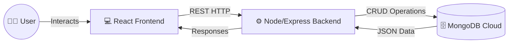

<div align="center">
  
  <h1>✨ StaxTech Insights Blog Platform ✨</h1>
  <p>A full-stack, highly scalable blog content management platform built on the MERN Stack.</p>

  <!-- Badges -->
  <p>
    
    
    
    
    
  </p>
</div>

---

## 🌟 Overview

Welcome to the **StaxTech Insights Blog Platform**. Engineered initially as a core project during an internship at **StaxTech**, this application has evolved into a fully functional, production-ready full-stack RESTful system. It features robust content creation pipelines, secure login interfaces, and a flawlessly responsive client-side experience. 

## 🚀 Key Features

* **Complete Article Lifecycle:** Create, Read, Update, and Delete capabilities for robust content handling.
* **Authentication Security:** Dedicated login interface preventing unauthorized write operations.
* **Responsive Fluid Design:** Carefully structured CSS ensuring usability across mobile, tablet, and desktop viewports.
* **Dynamic Article Rendering:** Seamless routing for individual post pages and list views.
* **Optimized Data Pipeline:** Extremely fast reads and writes via efficient MongoDB queries.

---

## 🛠️ Technology Stack

An enterprise-grade selection, often collectively referred to as the **MERN** stack:

* **Frontend Engine:** React 
* **Backend Architecture:** Node.js powered by Express
* **Database Management:** MongoDB
* **API Delivery:** RESTful architecture pattern

---

## 🏗️ Technical Architecture



---

## 📂 System Topology

```text
📦 StaxTech-Blog
 ┣ 📂 Front               # React Client Ecosystem
 ┃ ┣ 📂 src               # Components, pages, and context states
 ┃ ┣ 📂 public            # Distributable assets
 ┃ ┗ 📜 package.json      # Client dependencies
 ┗ 📂 api                 # Server Runtime Environment
   ┣ 📂 controllers       # REST Handlers
   ┣ 📂 models            # MongoDB Schemas
   ┣ 📂 routes            # Endpoint Definitions
   ┗ 📜 package.json      # Backend dependencies
```

---

<div align="center">
  <b>Built for scalability. Engineered with passion at StaxTech.</b>
</div>
